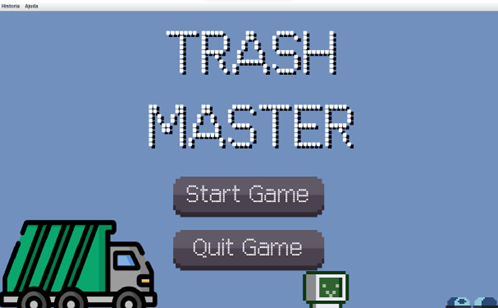

# Desenvolvimento de um jogo com a utilização de interface gráfica 🚀
Atividade Prática Supervisionada do 3° semestre do Curso de Ciências da Computação, da Universidade Paulista(UNIP), ministrada pelos professores:
- Olavo Ito, 
- [Gustavo Molina](https://github.com/gustavomolina17) 
- Claudio Furquim Jr 

     

O OBJETIVO

O presente trabalho tem como objetivo mostrar o impacto dos problemas ambientais urbanos, para assim, mesmo que de forma indireta, conscientizar sobre o meio ambiente. Baseando-se nesse problema, o foco se mantém em destacar a importância de não jogar resíduos e entulhos na rua de forma errada, logo, foi desenvolvido um jogo onde o usuário tem o desafio de pegar o lixo em um tempo específico. Haverá desafios no meio do caminho para o jogador se manter com o objetivo, assim obtendo recompensas. E nada melhor como usar Java, a Linguagem de Programação Orientada a Objetos, que permite com mais desempenho, a possibilidade de aproximar as estruturas do mundo real para o mundo digital.

REGRAS DO JOGO (CONCEITOS GERAIS)

COMPONENTES:

- ROBÔ
- LIXEIRAS   
- ARVORÉS 
- CARROS 
- LIXOS   
- ESTRADA 
- ESCUDO 
- CAIXÃO 

CONTROLES: 
- W: direção para cima;
- A: sentido para esquerda;
- S: direção para baixo;
- D: sentido para direita;
- SpaceBar: começar e pausar;

MANUAL:  

O jogador deverá controlar o robô com as teclas WASD, a fim de pegar todo o lixo, desviando dos obstáculos, como arvore, “paredes” e carros, o mais rápido possível para não perder o seu tempo, assim passando de nível. Lembrando que em cada nível, há um limite para a quantidade de lixo que o jogador está “segurando”, tendo que usar as lixeiras disponíveis no mapa para descartar todo o lixo que recolheu até o momento. A cada vez que passar por uma lixeira, seu lixo recolhido é descartado, fazendo com que o robô não trave e continue com a missão de pegar todos os lixos. 

Ao iniciar, a primeira tela que aparece ao jogador, contém ícones clicáveis: 

- História: onde ele poderá ver o recorde de pontuação em cada mapa e nível;
- Ajuda: que indica controles que podem ser utilizados e quem fez o jogo;
- Start Game: para começar o jogo;
- Quit Game: para sair;
- Ao clicar em Start Game, irá aparecer uma mensagem indicando a inserção do nome do jogador, logo depois, aparecerá a opção de escolha do nível de dificuldade e a escolha do mapa. Lembrando que, conforme nível escolhido, o limite da quantidade de lixos recolhidos, irá diminuir. 

Exemplo: no nível Paraíso, o jogador poderá recolher até 20 lixos. No nível terra 10 e no nível Inferno 5. Após limite atingido, o robô automaticamente não consegue mais recolher, tendo como obrigação, descartar o lixo recolhido na lixeira. Para deixar ainda mais interessante, foi inserido a opção de o jogador ligar ou desligar o som, sair ou reiniciar, nos ícones Música e Jogo, respectivamente. Além disso, jogo está programado para que de forma aleatória, apareça na estrada um escudo. Esse escudo irá ajudar o jogador a ter mais chance de não morrer ao bater em um carro.  

RESUMO:

No jogo há dois mapas:  
- Mapa n°1: TERRA   
- Mapa n° 2: INFERNO

Há 3 níveis:

- Sendo que cada nível contém a quantidade específica para limite de lixos recolhidos, velocidade e tempo do jogo.
 
- Para controlar o robô, use as teclas WASD.

- Para pausar ou começar, use o SpaceBar. 

- Para sair ou reiniciar, use o ícone Jogo.

